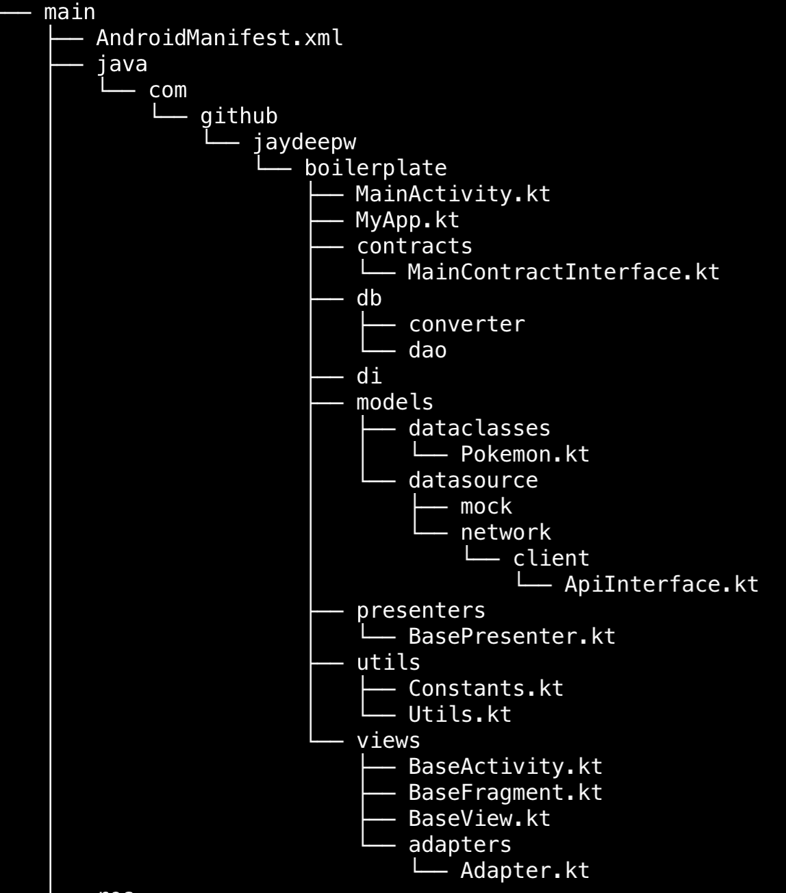

Android Boilerplate
===================

Boilerplate application code with defined package structure and all the standard dependencies

## About this boilerplate
This boilerplate has classes and package structure that one would generally model when implementing MVP architecture for Android app. It has following features
- Implemented completely in Kotlin :heart:

## Dependencies included
- Dagger2
- RecyclerView
- CardView
- Retrofit2
- Gson
- Room Architecture Component

## `main` source directory structure
Due to screen size constraints adding only the structure of the `main` source directory here
